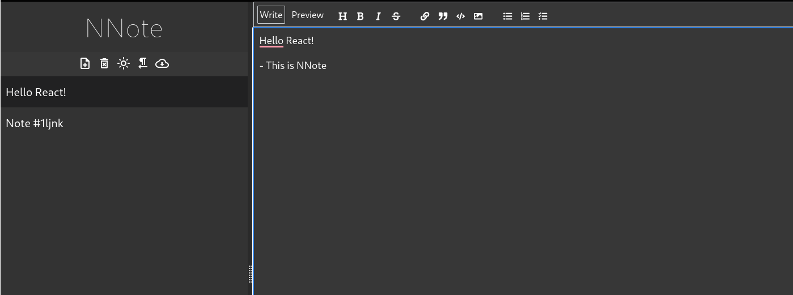

# Notes Manager (NNote)
## Overview
This is a simple notes manager application built using React. It allows users to create, edit, and delete notes. The application is designed to be user-friendly and easy to use.
<br/>


## Features
- Create Notes: Users can create new notes with a title and content.
- Edit Notes: Users can edit the title and content of existing notes.
- Delete Notes: Users can delete notes permanently.
- Note List: The application displays a list of all notes, including their titles and creation dates.
- RTL Support: The application's UI components are designed to be RTL-friendly, allowing users to easily switch between LTR (Left-to-Right) and RTL themes.
- Dark/Light Theme: Users can switch between a dark and light theme to personalize their experience.

## Installation
Clone the repository:
```git clone git@github.com:dmaon/notes-manager.git```

## Install dependencies:
```npm install```

## Start the application: 
```npm start```

## Usage
Open the application in your web browser:
```http://localhost:3000```

Create a new note by clicking the "Create Note" button.
Edit or delete existing notes by clicking the corresponding buttons.

## Technologies Used
React: For building the user interface and handling user interactions.
JavaScript: For writing the application logic.
HTML/CSS: For structuring and styling the user interface.

# Contributing
Contributions are welcome. If you'd like to contribute to this project, please fork the repository and create a pull request with your changes.

# License
This project is licensed under the MIT License. This README file provides an overview of your React-based notes manager project, including its features, installation instructions, usage guidelines, and contributing guidelines. It also includes information about the technologies used and the license under which the project is released.
